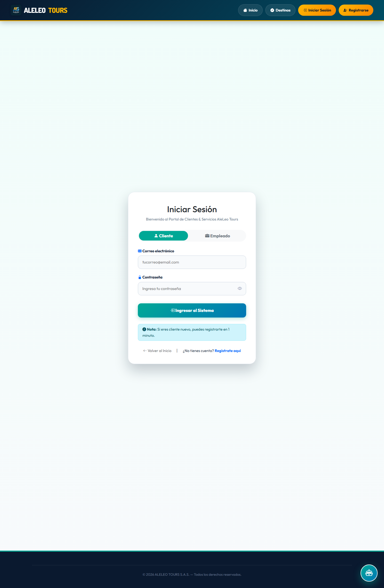
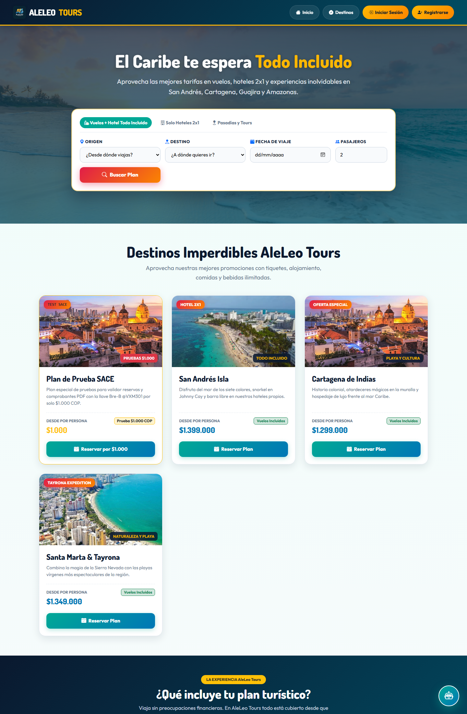
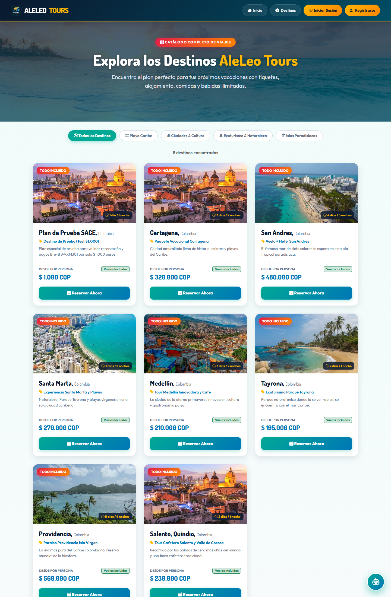

# Comprobante de despliegue — Sistema SACE (AleLeo Tours)

_Proyecto académico AleLeo Tours (SENA) · Ficha / Grupo: 3171149-B_
_Cesar Leonardo Ramírez Montejo · Yerson Alexei Torres Garcia · Felipe Gonzales Quitero_
_21 de septiembre de 2026_

## 6. Comprobante de despliegue — SACE (AleLeo Tours)
### 6.1 Fecha, equipo y alcance
Verificación de despliegue realizada el 21 de septiembre de 2026 sobre el equipo SIKS2301 (Windows 11), con los tres componentes del sistema ejecutándose de forma simultánea: PostgreSQL, backend Spring Boot y frontend estático. Se comprueban servicios en escucha, respuesta HTTP de la API y del sitio, existencia de la base de datos y datos semilla.

### 6.2 Servicios desplegados
| Componente | Tecnología | URL / puerto | Estado |
|---|---|---|---|
| Base de datos | PostgreSQL 18.4 | localhost:5432 — SACE_db | Activo |
| Backend (API REST) | Java 17 · Spring Boot 3.2 | http://localhost:8082/api | Activo |
| Frontend | HTML/CSS/JS · Bootstrap 5.3.3 | http://localhost:8091 (por defecto 8090) | Activo |
| Comprobantes PDF | Carpeta uploads/comprobantes | Servida por el backend | Activo |

### 6.3 Comandos de despliegue utilizados
     CREATE DATABASE SACE_db;

     cd backend-SACE && mvn spring-boot:run     # http://localhost:8082

     cd frontend-aleleo-tours && python -m http.server 8091 --bind 127.0.0.1

El backend crea el esquema con ddl-auto=update y DataInitializer siembra el administrador, el catálogo y las preguntas frecuentes.

### 6.4 Verificación de salud del entorno (salida real)
Salida capturada el 21 de septiembre de 2026:

```
== VERIFICACION DE DESPLIEGUE SACE - 21 de septiembre de 2026 ==
Equipo/host: SIKS2301
SO: Microsoft Windows 11 Home Single Language
PostgreSQL (5432): OK - PostgreSQL 18.4 on x86_64-windows, compiled by msvc-19.44.35226, 64-bit
Base SACE_db existe: SI
Tablas en SACE_db: 11
Backend GET /api/servicios - HTTP 200
  catalogo de servicios: 7 destinos
Backend POST /api/auth/login - OK (rol: ADMINISTRADOR, token 158 chars)
Frontend GET /login.html - HTTP 200 (8065 bytes)
Frontend GET /index.html - HTTP 200 (17049 bytes)
Frontend GET /destinos.html - HTTP 200 (13160 bytes)
Frontend GET /registro.html - HTTP 200 (9006 bytes)
Puertos escuchando (backend/frontend): 8082, 8091
```
### 6.5 Base de datos
La base SACE_db existe con 11 tablas en el esquema public (usuarios, solicitudes, mensajes, servicios, pagos, preguntas frecuentes, entre otras). El DDL del esquema completo se entrega en docs/SACE_db_ddl.sql; los datos no se distribuyen (los genera el sistema al iniciar).

### 6.6 Pruebas post-despliegue (humo)
| Prueba | Resultado |
|---|---|
| GET /api/servicios (catálogo público) | HTTP 200, 7 destinos |
| POST /api/auth/login con admin semilla | HTTP 200, rol ADMINISTRADOR, token firmado |
| Páginas login, index, destinos y registro | HTTP 200 en las 4 |
| Suite de regresión 62/62 (Plan de Pruebas, CP-01…CP-14) | 62 PASS / 0 FAIL |

### 6.7 Evidencia visual del sistema en ejecución
Se incluyen tres capturas del entorno desplegado (colaborador externo autenticado o vista pública), disponibles además en 7_Despliegue/Capturas_Despliegue/ y en docs/capturas/ del repositorio:







### 6.8 Notas y recomendaciones
- En la verificación local el frontend se sirvió en el puerto 8091 porque el 8090 estaba ocupado temporalmente por un proceso externo; el valor por defecto documentado sigue siendo 8090.
- Antes de exponer el sistema en producción: cambiar SACE_TOKEN_SECRET, la contraseña de PostgreSQL y las credenciales SMTP, y rotar el administrador semilla (admin123).
- Mantener copias de respaldo del modelo de datos con pg_dump.